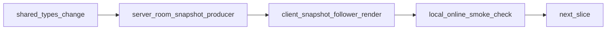

# Lean Client Separation Audit

## Scope

This audit maps current separation between client/local/online/server/shared and defines what to move next to keep the client as lean as possible (render, UI, input only), while preserving local feel parity.

## 1) Responsibility Matrix (Current State)

| Feature | Source of truth | Write path(s) | Read/render path(s) | Duplication / separation risk |
|---|---|---|---|---|
| Core race sim (movement, drift, checkpoints, finish) | `shared/sim.ts` + server authority | `server/src/room.ts` (`stepAuthoritativeRace`), local compatibility path in `client/src/game/Game.ts` (`updateRace`) | `client/src/game/Game.ts` (`updateSnapshotFollowerRace`, HUD updates) | Local authority compatibility still exists in client and can drift from online orchestration behavior. |
| Items (pickup/use/respawn) | `shared/sim.ts` | server: `room.ts` (`stepItemBoxes`, `collectNearbyItem`, `useHeldItem`); local: `Game.ts` local loop | `client/src/game/ItemSystem.ts` visuals (`applyOnlineItemBoxes`, `playOnlineItemEffect`) | `ItemSystem.ts` still contains dormant authority code paths. |
| Obstacles | Server state + `shared/sim.ts` | server: `room.ts` (`obstacles`, `stepObstacles`) | client: inferred mostly from events/effects, no authoritative obstacle snapshot state | Online visual/state mismatch risk because obstacle state is not in snapshot contract. |
| Standings | Server (`room.ts`) using shared placements | `room.ts` (`makeStandings`, `computeSharedPlacements`) | online: `Game.setOnlineStandings`; local HUD fallback uses `Game.getPositions()` | Local HUD rank computation still separate from shared placement semantics. |
| Race end / top3 | server authority for online; client local path for local mode | online: `room.ts` phase transitions; local: `Game.checkRaceEnd` | `client/src/main.ts` + `Game.ts` race-end UI | Dual race-end flows increase maintenance surface and behavior drift risk. |
| Track spawn/start frame | `shared/sim.ts` | server spawn + client track start grid both call shared start-frame helpers | `Track.ts`, `room.ts` | Mostly unified now; low residual risk. |
| Camera / spectator POV | client presentation | `Game.ts` camera state machines | `FollowCamera`, `Game.ts` camera loop | Mode-specific branches still complex; regressions possible when localSlot/spectator paths change. |
| Protocol channeling | shared types + server transport | server sends `room_state` + `race_snapshot`; client consumes both | `RoomClient.ts`, `main.ts`, `Game.ts` | Meta + race overlap remains; high-rate paths still partially duplicated semantically. |

## 2) Live Parity Trace (Structured)

Runs executed:
- Local: WATCH AI MATCH (LOCAL), ~56s
- Online: spectator host + 4 AIs, ~55s

### Checklist

| Check | Local | Online | Notes |
|---|---|---|---|
| Pickup at rendered position | PASS | PASS | Observationally aligned in both runs. |
| Drift hop visual | FAIL | FAIL | Not clearly observed in the sampled windows. |
| Ramp jump visual | FAIL | FAIL | Not clearly observed in the sampled windows. |
| Obstacle visual/state alignment | PASS (low confidence) | FAIL | Online showed eliminated/state mismatch symptoms while world/pickup feedback continued. |
| Standings/HUD alignment | PASS | PASS | Internal ordering looked consistent with visible motion/minimap. |
| Race-end/top3 timing + POV behavior | FAIL (not reached in window) | FAIL | Online did not show clean finish transition during sample. |

### Failure Classification

- Drift hop/ramp jump visibility failures: **interpolation/presentation gap**
- Online obstacle/state mismatch: **interpolation/presentation gap** (authoritative state not fully represented in render contract)
- Online race-end/top3 transition issue: **authority gap** (phase/state progression to presentation not fully coherent)
- Local race-end not reached during window: **protocol/testing-window gap** for parity verification (not enough time/conditions to evaluate)

## 3) Prioritized Move List (P0 / P1 / P2)

## P0 (Highest Impact)

1. **Add authoritative obstacle state to snapshot protocol**
   - Files:
     - `shared/types.ts`
     - `server/src/room.ts`
     - `client/src/game/Game.ts`
     - `client/src/game/ItemSystem.ts`
   - Contract delta:
     - Add `obstacles?: OnlineObstacleState[]` to `OnlineRaceSnapshot`.
     - Define `OnlineObstacleState` with at minimum `{ x, y, z, kind, ttlMs }`.
   - Effect:
     - Client renders obstacle visuals from snapshot state, not inferred event side-effects.

2. **Unify standings/HUD source to canonical placements in all modes**
   - Files:
     - `client/src/game/Game.ts`
     - `shared/sim.ts` (reuse `computePlacements` only; no new ranking logic in client)
   - Delta:
     - Replace local HUD `getPositions()`-based rank source with canonical placement order -> rank mapping consistent with server semantics.

3. **Normalize race-end/top3 presentation trigger path**
   - Files:
     - `client/src/main.ts`
     - `client/src/game/Game.ts`
     - `server/src/room.ts`
   - Delta:
     - Single finish trigger contract from server (`phase=finished` + stable final standings snapshot), one rendering path in client.

## P1

1. **Remove dormant client authority surfaces**
   - Files:
     - `client/src/game/ItemSystem.ts` (remove/retire authority mutation methods)
     - `client/src/game/Kart.ts` (extract authority mutators to offline adapter or isolate behind explicit offline module)
   - Delta:
     - Online runtime cannot accidentally mutate gameplay via legacy APIs.

2. **Reduce race/meta overlap in realtime channels**
   - Files:
     - `shared/types.ts`
     - `server/src/server.ts`
     - `client/src/online/RoomClient.ts`
   - Delta:
     - Keep race data in `race_snapshot`; send `room_state` only on lobby/meta transitions.

## P2

1. **Shared track layout sanitize/normalize for both local and online start**
   - Files:
     - `shared/sim.ts` (or shared validator module)
     - `client/src/main.ts` / `client/src/game/Track.ts`
     - `server/src/room.ts`
   - Delta:
     - Same validation/normalization path before either local or online race starts.

2. **Transient event reliability hardening**
   - Files:
     - `shared/types.ts`
     - `server/src/room.ts`
     - `client/src/game/Game.ts`
   - Delta:
     - Add event sequence index or short event history window to snapshots to reduce missed drift/jump/item FX under packet/frame loss.

## 4) Execution Slice Roadmap

Slice order:
1. Obstacle snapshot contract slice (P0-1)
2. Canonical standings/HUD slice (P0-2)
3. Race-end/top3 single-path slice (P0-3)
4. Client authority-surface cleanup slice (P1-1)
5. Channel overlap reduction slice (P1-2)
6. Layout normalization + event reliability slices (P2)

## Verification Gates (per slice)

- Build gate: `client` + `server` TypeScript builds pass.
- Lint gate: no new lint issues in touched files.
- Runtime parity gate:
  - pickup/render alignment
  - jump/drift feedback visibility
  - obstacle visual/state coherence
  - standings and race-end/top3 coherence
- Regression gate:
  - no gameplay writes in online client path
  - deterministic parity test remains green (`server/src/parity.test.ts`)

